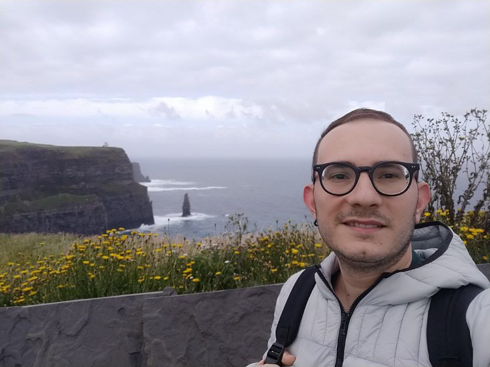

# Welcome to my personal website

## About me
Hi, I am Alessio Barbieri and welcome to my personal page. I have a Ph.D. in Mathematics and Modelling earned at Università degli Studi dell'Aquila (Italy). You can reach me at:
- [alessiobar95@outlook.it](mailto:alessiobar95@outlook.it)
- [alessio.barbieri@graduate.univaq.it](mailto:alessio.barbieri@graduate.univaq.it) valid until August 2025
- [alessio.barbieri@unitus.it](mailto:alessio.barbieri@unitus.it)

## Resume
[Curriculum Vitae/Resume](Curriculum Vitae_Alessio Barbieri.pdf)

## Links
-[Research Gate](https://www.researchgate.net/profile/Alessio-Barbieri-2?ev=hdr_xprf)

-[Google Scholar](https://scholar.google.com/citations?user=KN1wbBcAAAAJ&hl=it)

-[Web of Science](https://www.webofscience.com/wos/author/record/MHQ-0041-2025)

-[Orcid](https://orcid.org/my-orcid?orcid=0000-0003-3737-085X)

## Scientific Papers
My main research interests are:
- Semigroup Theory,
- Infinite-dimensional control systems,
- Functional Analysis,
- Operator Theory,
- PDEs

Here you can find my research papers.
[Scientific Papers](papers.md)
